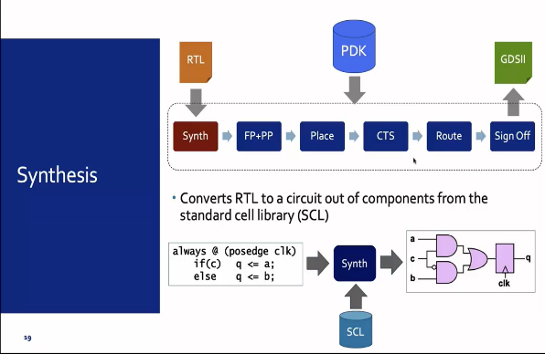
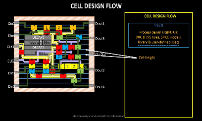
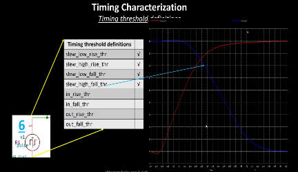
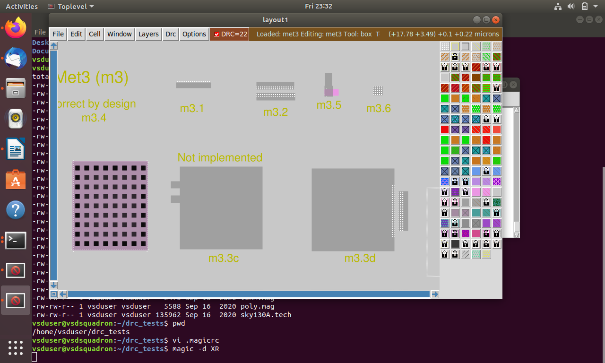
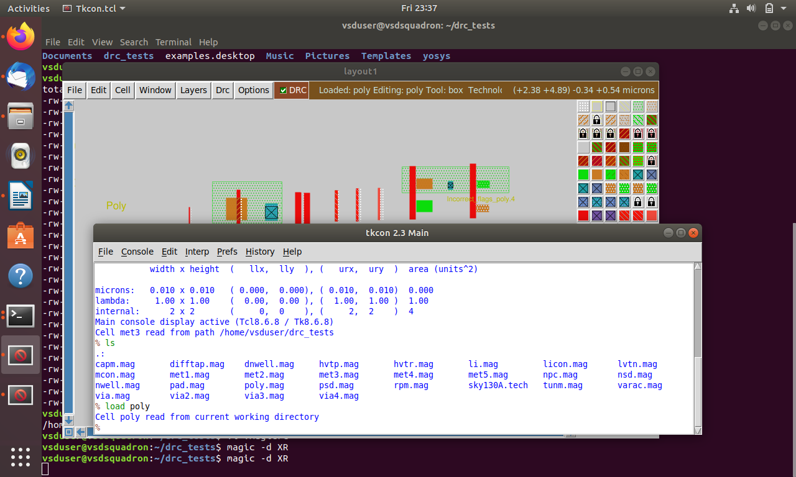

**NASSCOM VSD SoC Design Program**

**Sky130 Day 1 - Inception of open-source EDA, OpenLANE and Sky130 PDK**

**SKY130_D1_SK1 - How to talk to computers**

**Introduction to QFN-48 Package, chip, pads, core, die and IPs**

All embedded boards contain processor chips. The block diagram of the Arduino board is shown below where the centre piece that is highlighted is Processor, along with the processor we have other interfaces around it.

 

The black chip shown below is a package, with the actual chip located inside this package. The package shown is a QFN (Quad Flat No-leads) 48 package. The actual chip pins are connected to the package pins using wire bonds.

Upon opening the real chip, we can see the pads that connect the pins to the outside. Any signal entering or exiting the chip does so through these pads. Then we have the core, which contains all the digital logic. The die comprises both the core and the pads together. Chip Internals: Inside the core, we have MACROs (SoC, GPIO Banks, SPIs) and Foundry IPs (like PLL, SDCs, DAC, SRAM). MACROs are pure digital logic whereas Foundry IPs need some intelligence to write.

 

**Introduction to RISC-V**

RISC-V is an open-source instruction set architecture (ISA) that is adopted in the world of computer architecture and processor design. It was originally developed at the University of California, Berkeley in 2010 and has since grown into a global collaboration of researchers and industry experts. The key characteristic of RISC-V is its simplicity and modularity. It follows the Reduced Instruction Set Computer (RISC) design philosophy, which emphasizes a small and streamlined set of instructions that are easy to decode and execute. RISC-V offers a base set of instructions, called the "RV32I," which provides essential operations for general-purpose computing. Additional optional instruction sets, such as RV32F for single-precision floating-point operations or RV64G for 64-bit computing, can be added to meet specific application requirements. One of the major advantages of RISC-V is its open nature. The ISA specifications, reference implementations, and software tools are freely available, allowing anyone to study, modify, or implement their own RISC-V processors without licensing fees or restrictions. This openness has fostered a vibrant ecosystem of hardware designers, software developers, and researchers who collaborate and innovate around the RISC-V architecture.

C Program ----\> Assembly Language (RISC V) ---\> Machine Language (Binary form) ----\> The bits get executed on the chip layout

Another interface that needs to be represented between RISC V and the layout is the Hardware Description Language. The particular RISC V specifications need to be described or implemented using some RTL(example implementation of picorv32 CPU core shown in image). Then follows the RTL to layout or RTL to GDSII flow

**From Software Applications to Hardware**

All the software applications we use in our daily lives rely on hardware to run. The system software is responsible for translating the application program into binary language, which the hardware can understand and execute. The primary components of system software include the Operating System (OS), Compiler, and Assembler. The OS plays a crucial role in managing various aspects of the computer system. It provides an environment for the application program to run and handles tasks such as memory management, process scheduling, and input/output operations. Depending on the underlying architecture, such as MIPS, x86, x64, or RISC-V, the OS translates the application program into assembly language instructions. The compiler is responsible for converting high-level programming languages, like C or Java, into assembly-level language instructions. This translation process is influenced by the specific architecture on which the software will be executed. Different architectures have their own instruction sets, and the compiler ensures that the instructions generated are compatible with the targeted architecture. Once the code is in assembly language, the assembler comes into play. It takes the assembly code and translates it into binary code, which is a sequence of 0s and 1s that can be directly dumped into the hardware.

Any C/C++/VB/JAVA function --\> respective language compiler --\> converted into hardware based instruction set--\> assembler --\> hexa-decimal representation of instructions (binary form. .exe file) --\> enter chip--\> hardware responds as per incoming bitstream.

The syntax of the instruction set at compiler output is dependent on hardware architecture. E.g., for x86, ARM, RISC V types of hardware, the instruction set will also be in x86, ARM, RISC V format respectively. The final output binary pattern decides what should be the hardware should be doing. An example of a C input program compiled into instructions is given below: The instruction set acts as an abstract interface between the C language function and the hardware.

 

**SKY130_D1_SK2 - SoC Design and OpenLANE**

**ASIC Design Flow**

ASIC (Application-Specific Integrated Circuit) design flow refers to the series of steps involved in designing a custom chip tailored for a specific application. Unlike general-purpose ICs, ASICs are optimized for particular tasks, making them highly efficient for their intended purpose. The design flow is a structured process that ensures the final chip meets all functional, performance, and manufacturability requirements.

Major Steps in the ASIC Design Flow

1.  Specification:
2.  Design Entry (RTL Design)
3.  Functional Verification
4.  Synthesis
5.  Design for Testability (DFT)
6.  Static Timing Analysis (STA)
7.  Floorplanning
8.  Placement and Routing
9.  Power Analysis
10. Physical Verification
11. RC Extraction and Post-Layout STA
12. Signoff and GDSII Generation
13. Fabrication
14. Testing and Packaging

**RTL IPs**, or Register Transfer Level Intellectual Property, refer to pre-designed and pre-verified digital hardware components or blocks that are described at the Register Transfer Level (RTL). RTL is a hardware description language (HDL) representation of a digital circuit or a portion of a circuit. In the context of integrated circuit (IC) design, an IP refers to a reusable building block that can be integrated into a larger design. RTL IPs, specifically, are designed at the register transfer level, which represents the flow of data between registers and the operations performed on that data. These IPs can be licensed from IP vendors or developed in-house. They provide a level of abstraction that allows designers to focus on higher-level design aspects rather than implementing low-level details from scratch. RTL IPs offer various advantages, such as improved productivity, faster time-to-market, and increased design reliability. By using RTL IPs, designers can leverage optimized and well-tested building blocks, reducing the likelihood of errors and bugs. Additionally, using RTL IPs promotes design reuse, enabling designers to create complex systems by assembling and integrating different IP blocks.

**EDA (Electronic Design Automation) tools** are software applications used in the design, development, and analysis of electronic systems, including integrated circuits (ICs), printed circuit boards (PCBs), and other electronic components. These tools automate various tasks involved in the design process, increasing efficiency and reducing time-to-market.

**Process Design Kit (PDK)** is a set of files used within the semiconductor industry to model a fabrication process for the design tools used to design an integrated circuit. PDK’s are often specific to a foundry and may be subject to a non-disclosure agreement. While most PDK’s are proprietary to a foundry, certain PDKs are opensource and entirely within the public domain. Traditionally, PDKs have been proprietary and provided by semiconductor foundries, limiting access and customization options for IC designers. However, open-source PDKs aim to promote collaboration, innovation, and accessibility by making the design kit freely available to the community. By providing an open-source PDK, designers can modify and customize the kit to suit their specific requirements. This flexibility allows for greater innovation, collaboration, and knowledge sharing within the design community. It also lowers the barriers to entry for new designers and encourages participation in the development of new ICs and electronic systems. Some of the open-source PDKs are: SKY130, GFU180, ASAP7 etc

Here are some key components and aspects of a PDK:

a. Design Rules: These are the geometric constraints that define how small the features can be, how close they can be to each other, and other layout considerations to ensure that the design can be manufactured without defects.

b. Device Models: These are mathematical models that represent the electrical behaviour of transistors and other components. They are used in simulation to predict how the circuit will perform before it is fabricated.

c. Layout Libraries: These include standard cells, IP blocks, and other pre-designed components that can be used as building blocks in the design process. They are typically provided in a format that can be used with electronic design automation (EDA) tools.

d. Technology Files: These files contain information about the fabrication process, such as layer stacks, materials, and process-specific parameters. They are used by EDA tools to ensure that the design adheres to the specific requirements of the fabrication process.

e. Simulation Models: In addition to device models, PDKs may include other simulation models for parasitic extraction, reliability analysis, and other aspects of circuit performance.

f. Documentation: PDKs come with extensive documentation that explains how to use the kit, the meaning of various parameters, and the best practices for design with the specific process.

g. Characterization Data: This includes measured data from test structures that have been fabricated and tested on the actual process. This data is used to validate the accuracy of the models and design rules.

h. Support and Updates: PDKs are often accompanied by support from the foundry or IP provider, including updates to reflect process improvements or corrections.

**Simplified RTL to GDSII flow using OpenLANE**

The RTL to GDSII flow basically involves:

1.  **RTL Design** - The process begins with the RTL design phase, where the digital circuit is described using a hardware description language (HDL) like VHDL or Verilog. The RTL description captures the functional behaviour of the circuit, specifying its logic and data paths.
2.  **RTL Synthesis** - RTL synthesis converts the high-level RTL description into a gate-level netlist. This stage involves mapping the RTL code to a library of standard cells (pre-designed logic elements) and optimizing the resulting gate-level representation for area, power, and timing. The output of RTL synthesis is typically in a format called the gate-level netlist.

     

3.  **Floor and Power Planning** - is a crucial step in the digital design flow that involves partitioning the chip's area and determining the placement of major components and functional blocks. It establishes an initial high-level layout and defines the overall chip dimensions, locations of critical modules, power grid distribution, and I/O placement.The primary goals of floor planning are: Area Partitioning, Power Distribution, Signal Flow and Interconnect Planning, Placement of Key Components, Design Constraints and Optimization.

     

4.  **Placement** - Placement involves assigning the physical coordinates to each gate-level cell on the chip's layout. The placement process aims to minimize wirelength, optimize signal delay, and satisfy design rules and constraints. Modern placement algorithms use techniques like global placement and detailed placement to achieve an optimal placement solution.

     

5.  **Clock Tree Synthesis** - Clock tree synthesis (CTS) is a crucial step in the digital design flow that involves constructing an optimized clock distribution network within an integrated circuit (IC). The primary goal of CTS is to ensure balanced and efficient clock signal distribution to all sequential elements (flip-flops, registers) within the design, minimizing clock skew and achieving timing closure.

    

6.  **Routing** - Routing connects the gates and interconnects on the chip based on the placement information. It involves determining the optimal paths for the wires and vias that carry signals between different components. The routing process needs to adhere to design rules, avoid congestion, and optimize for factors like signal integrity, power, and manufacturability.

     

7.  **Sign-off** - Sign-off analysis refers to the final stage of the electronic design process, where comprehensive verification and analysis are performed to ensure that the design meets all the necessary requirements and specifications. It involves a series of checks and simulations to confirm that the design is ready for fabrication and meets the desired functionality, performance, power, and reliability targets.

    

8.  **GDSII File Generation** - Once the layout is verified and passes all checks, the final step is to generate the GDSII file format, which represents the complete physical layout of the chip. The GDSII file contains the geometric information necessary for fabrication, including the shapes, layers, masks, and other relevant details.

**Introduction to OpenLANE**

OpenLANE is an automated RTL to GDSII flow based on several components including OpenROAD, Yosys, Magic, Netgen, CVC, SPEF-Extractor, KLayout and several custom scripts for design exploration and optimization. It also provides several custom scripts for design exploration and optimization. The flow performs all ASIC implementation steps from RTL all the way down to GDSII. Currently, it supports both A and B variants of the sky130 PDK, the C variant of the gf180mcu PDK, and instructions to add support for other (including proprietary) PDKs are documented. The whole documentation can be found here [<https://github.com/The-OpenROAD-Project/OpenLane>]. OpenLANE abstracts the underlying open source utilities and allows users to configure all their behaviour with just a single configuration file.

**OpenLANE Architecture**

**OpenLANE Design Stages**

OpenLANE flow consists of several stages. By default all flow steps are run in sequence. Each stage may consist of multiple sub-stages. OpenLANE can also be run interactively.

1.  **Synthesis**
    1.  yosys/abc - Perform RTL synthesis and technology mapping.
    2.  OpenSTA - Performs static timing analysis on the resulting netlist to generate timing reports
2.  **Floorplaning**
    1.  init_fp - Defines the core area for the macro as well as the rows (used for placement) and the tracks (used for routing)
    2.  ioplacer - Places the macro input and output ports
    3.  pdngen - Generates the power distribution network
    4.  tapcell - Inserts welltap and decap cells in the floorplan
3.  **Placement**
    1.  RePLace - Performs global placement
    2.  Resizer - Performs optional optimizations on the design
    3.  OpenDP - Performs detailed placement to legalize the globally placed components
4.  **CTS**
    1.  TritonCTS - Synthesizes the clock distribution network (the clock tree)
5.  **Routing**
    1.  FastRoute - Performs global routing to generate a guide file for the detailed router
    2.  TritonRoute - Performs detailed routing
    3.  OpenRCX - Performs SPEF extraction
6.  **Tapeout**
    1.  Magic - Streams out the final GDSII layout file from the routed def
    2.  KLayout - Streams out the final GDSII layout file from the routed def as a back-up
7.  **Signoff**
    1.  Magic - Performs DRC Checks & Antenna Checks
    2.  KLayout - Performs DRC Checks
    3.  Netgen - Performs LVS Checks
    4.  CVC - Performs Circuit Validity Checks

OpenLANE integrated several key open-source tools over the execution stages:

-   RTL Synthesis, Technology Mapping, and Formal Verification: [yosys + abc](https://github.com/YosysHQ/yosys)
-   Static Timing Analysis: [OpenSTA](https://github.com/The-OpenROAD-Project/OpenSTA)
-   Floor Planning: [init_fp](https://github.com/The-OpenROAD-Project/OpenROAD/tree/master/src/ifp), [ioPlacer](https://github.com/The-OpenROAD-Project/OpenROAD/tree/master/src/ppl), [pdn](https://github.com/The-OpenROAD-Project/OpenROAD/tree/master/src/pdn) and [tapcell](https://github.com/The-OpenROAD-Project/OpenROAD/tree/master/src/tap)
-   Placement: [RePLace](https://github.com/The-OpenROAD-Project/OpenROAD/tree/master/src/replace) (Global), [Resizer](https://github.com/The-OpenROAD-Project/OpenROAD/tree/master/src/rsz) and [OpenPhySyn](https://github.com/scale-lab/OpenPhySyn) (formerly), and [OpenDP](https://github.com/The-OpenROAD-Project/OpenROAD/tree/master/src/dpl) (Detailed)
-   Clock Tree Synthesis: [TritonCTS](https://github.com/The-OpenROAD-Project/OpenROAD/tree/master/src/cts)
-   Fill Insertion: [OpenDP/filler_placement](https://github.com/The-OpenROAD-Project/OpenROAD/tree/master/src/dpl)
-   Routing: [FastRoute](https://github.com/The-OpenROAD-Project/OpenROAD/tree/master/src/grt) or [CU-GR](https://github.com/cuhk-eda/cu-gr) (formerly) and [TritonRoute](https://github.com/The-OpenROAD-Project/OpenROAD/tree/master/src/TritonRoute) (Detailed) or [DR-CU](https://github.com/cuhk-eda/cu-gr)
-   SPEF Extraction: [OpenRCX](https://github.com/The-OpenROAD-Project/OpenROAD/tree/master/src/rcx) or [SPEF-Extractor](https://github.com/AUCOHL/spef-extractor) (formerly)
-   GDSII Streaming out: [Magic](https://github.com/RTimothyEdwards/magic) and [KLayout](https://github.com/KLayout/klayout)
-   DRC Checks: [Magic](https://github.com/RTimothyEdwards/magic) and [KLayout](https://github.com/KLayout/klayout)
-   LVS check: [Netgen](https://github.com/RTimothyEdwards/netgen)
-   Antenna Checks: [Magic](https://github.com/RTimothyEdwards/magic)
-   Circuit Validity Checker: [CVC](https://github.com/d-m-bailey/cvc)

Everything in Floorplanning through Routing is done using [OpenROAD](https://github.com/The-OpenROAD-Project/OpenROAD) and its various sub-utilities.

**SKY130_D1_SK3 - Getting familiar with open-source EDA tools**

**Snippets:**

Changing the terminal directory to Desktop/work/tools/openlane_working_dir/openlane and making it interactive

****

Adding the package required and Design set up stage

****

Synthesis task of picorv32a

****

Chip area for picorv32a

****

Finding the flop ratio

Flop ratio = Number of D Flip flops / Total number of cells

****

Flop ratio = 1613 / 14876 = 0.10843

% ratio = 10.842

**SKY130_D2_SK1 - Good floorplan vs bad floorplan and introduction to library cells**

**SKY130_D2_SK1 - Chip Floor planning considerations**

**Utilization factor and Aspect ratio:**

** **

Utilization Factor = Area occupied by netlist / Total area of the core

Aspect Ratio = Height of Core/ Width of Core

When the aspect ratio is 1, the chip is squared in shape.

**Pre-Placed cells:**

** **

The pre-placed cells are typically larger and more complex modules, such as memory blocks, complex functional units, or other predefined structures that are designed separately and then positioned in the layout before the placement and routing stages. Pre-placed cells are often used for several reasons:Performance optimization, IP integration and Power optimization. The preplaced cells are reused in the designs.These pre-placed cells should be surrounded by de-coupling capacitors. Decoupling capacitors are large capacitors that store electrical charge. They have a voltage across them similar to that of the power supply. When a circuit switches, the decoupling capacitor acts as a power source for the circuit, effectively isolating it from the main power supply. During switching events, the decoupling capacitor supplies the necessary current to the circuit. To minimize voltage drops, these capacitors are positioned in close proximity to the circuit. They ensure that the circuit receives the required current during switching operations. The purpose of the decoupling capacitor is to charge the circuit. When a switching activity occurs, the decoupling capacitor transfers some of its charge to the circuit. During periods of no switching activity, the decoupling capacitor replenishes its charge from the power supply.

**De-Coupling Capacitors:**

** **

** **

Decoupling capacitors constitute an indispensable element within the realm of electronic circuit design, particularly in the context of integrated circuits (ICs) and printed circuit boards (PCBs). Their primary purpose revolves around the stabilization of power supply voltage levels, a crucial function in mitigating noise and upholding consistent voltage for delicate components. As electronic apparatuses operate at elevated frequencies, abrupt shifts in current demands can incite voltage fluctuations and unwanted noise, thereby resulting in performance dilemmas and signal deterioration. Decoupling capacitors, akin to a safeguard, establish a local storehouse of electrical charge that can swiftly respond to these fluctuations. Essentially, they act as reservoirs, storing and disbursing electrical energy as required, effectively sieving out undesirable noise and voltage oscillations.

Decoupling capacitors are strategically sited near power-thirsty constituents, such as microprocessors, digital logic circuits, or high-speed memory modules, where they adeptly soak up and provide instant current requisites. Through curbing voltage fluctuations, they heighten the overall fidelity of signals and prevent potential issues like ground disturbance, signal interference, and electromagnetic perturbations. The physical configuration of decoupling capacitors necessitates judiciously determining the appropriate capacitance magnitude, voltage rating, and package dimensions based on the distinct requisites of the circuit. The capacitance value must adequately meet current necessities and the frequency spectrum of the circuit. Greater capacitance values promise superior noise suppression but can introduce bulkier physical dimensions and cost ramifications. Furthermore, the placement of decoupling capacitors assumes paramount importance, requiring them to be positioned as proximate as feasible to the power and ground pins of the targeted components, thereby minimizing inductance and resistance along the supply path. This proximity ensures efficient energy transmission between the power source and the components, concurrently diminishing impedance and maximizing the capacitor's efficacy.

**Power Planning:**

 ** **

Power planning in integrated circuit (IC) design involves the careful consideration and distribution of power and ground connections to ensure proper functionality and performance of the chip. One important aspect of power planning is the placement of multiple ground (GND) and supply voltage (VDD) points throughout the IC layout. The need for multiple GND and VDD points arises due to several reasons: By providing multiple GND and VDD points, the power can be distributed more evenly throughout the chip, reducing the chances of voltage drops and improving overall power delivery efficiency. Ground bounce occurs when there are variations in the voltage levels of different GND points due to transient currents. Similarly, power supply noise refers to fluctuations in the VDD levels caused by switching events. By strategically placing multiple GND and VDD points, the impact of ground bounce and power supply noise can be minimized, improving circuit performance and reducing the risk of functional failures.

**Pin Placement and logical cell placement blockage:**

** **

Pin placement in physical design is all about how and where we put the input/output pins on a chip or circuit board. It's important because it affects how well signals move around, how little they get messed up, and how easy it is to build and test the device. We have to think about things like keeping the signals strong, spreading out power evenly, managing heat, and making sure it fits with standard connectors and packaging. When we do this pin placement right, it makes the electronic system more reliable, easier to build, and more user-friendly.

**Steps to run floorplan using OpenLANE:**

**Snippets:**  
To perform floor planning: run_floorplan

Desktop/work/tools/openlane_working_dir/openlane/configuration - README.md contains all the configurations of the different stages in the design flow.

Desktop/work/tools/openlane_working_dir/openlane/configuration – floorplan.tcl contains all the default parameter values of the floorplan stage in openLANE.

Once the floorplan is complete, you can review the generated report to access aspects such as die area in def file. However, to visualize the design in a graphical user interface (GUI), you should use the MAGIC tool.

**Design Alignment Instructions**

**Centring the Design:**

1.  Press S to select the entire design.
2.  Press V to vertically align it to the middle of the screen.

**Zooming In on a Specific Area:**

1.  Left click and drag to select the desired region.
2.  Right-click to bring up the context menu.
3.  Press Z to zoom in on the selected area.

**Getting Details of a Cell:**

1.  Move your cursor to the cell of interest.
2.  Press S to select the cell.
3.  In the tkcon window, enter the command "what" to display cell details.

**SKY130_D2_SK2 - Library Binding and placement -** Placement and Routing

**Netlist binding and initial place design**

In a netlist every element has its own shape, for example AND gate has a shape and OR gate has a different shape. But in a library every element has only a square or rectangle shape. A Library consists of every element that can be readily used and these elements come with their respective properties such as area, delay, timing information, required conditions etc. We will have different versions of the same element with different properties. The elements which are larger in size are faster but occupies larger area and the smaller set will occupy less area but are slower when compared to larger ones.

 

**Optimize placement using estimated wire-length and capacitance**

During Placement we should consider the estimated wire length and place the cells according to it. Wire length is estimated by calculating the distance from input source of those cells and the distance to the output sinks that are being driven by them.

**Final placement optimization**

This is the stage where we estimate wire length and capacitances and based on that we insert repeaters(Buffers).

 ****

**Need for libraries and characterization**

**    **

All these stages commonly have gates or cells and theses collection of gates placed in an area is called Library. That means without librabries, all these stages can’t be performed. That’s why Librabries are needed.

****

**Congestion aware placement using RePlAce**

Placement stage is of two stages:

Global Placement:

It assigns general locations to movable objects(cells). Some overlaps between placed objects are allowed during this stage and the goal of this stage is to achieve a rough layout that satisfies area constaraints.

Detailed Placement:

It refines the object locations obtained from global placement. It enforces non-overlapping constraints and ensures that cells are placed on legal cell sites. The quality of detailed placement significantly impacts subsequent routing stages.

Running Placemet:

run_placement

****

After Placement is done to check whether the cells are placed correctly or not, we need to check GUI and that will be done using MAGIC tool with the following command

magic -T /home/vsduser/Desktop/work/tools/openlane_working_dir/pdks/sky130A/libs.tech/magic/sky130A.tech lef read ../../tmp/merged.lef def read picorv32a.placement.def &

**SKY130_D2_SK3 - Cell design and characterization flows**

**Cell Design Flow**

The cell design flow is a systematic process used to create and optimize individual cells within an integrated circuit (IC). These cells are basic building blocks, such as logic gates, flip-flops, or other functional units. The cell design flow typically involves the following steps:

**1-Specification and Requirements:**

a. Define the cell's functionality and performance requirements (e.g., speed, power, area).

b. Establish operating conditions and constraints.

**2-Conceptual Design:**

a. Develop a high-level representation using hardware description languages (HDL) like Verilog or VHDL.

b. Perform initial simulations to validate the concept.

**3-Schematic Capture:**

a. Create a detailed schematic using electronic design automation (EDA) tools.

b. Include all necessary components (transistors, resistors, capacitors, etc.).

**4-Circuit Simulation:**

a. Simulate the cell using tools like SPICE to verify functionality and performance.

b. Adjust the design as needed to meet specifications.

**5-Layout Design:**

a. Translate the schematic into a physical layout, placing and routing components on the silicon substrate.

b. Ensure adherence to design rules and constraints.

**6-Layout Versus Schematic (LVS) Check:**

a. Compare the layout to the schematic to ensure they match.

b. Fix any discrepancies.

**7-Design Rule Check (DRC):**

a. Verify that the layout complies with fabrication design rules.

b. Make necessary adjustments to pass the DRC.

**8-Extraction:**

a. Extract parasitic capacitances, resistances, and inductances from the layout.

b. Use this information for post-layout simulation.

**9-Post-Layout Simulation:**

a. Simulate the cell with extracted parasitics to ensure it still meets performance requirements.

b. Iterate on the design if necessary.

**10-Validation and Testing:**

a. Conduct additional simulations and checks to validate the design.

b. Perform physical testing on fabricated cells to ensure they meet specifications.

**11-Library Integration:**

a. Integrate the cell into a cell library for use in larger IC designs.

b. Ensure compatibility with other cells in the library.

****

**Design Steps**

1.  **Circuit Design:**
    -   Create the logical schematic of your circuit.
    -   Define the functionality and connections of standard cells.
2.  **Layout Design:**
    -   Use layout tools (e.g., MAGIC) to create the physical layout.
    -   Follow design rules and guidelines for placement and routing.
3.  **Characterization using GUNA:**
    -   Perform timing, power, and noise characterizations.
    -   Validate the design against specifications.

**Outputs**

-   **CDL (Circuit Description Language):** A textual representation of the circuit.
-   **GDSII:** The layout file in GDSII format for fabrication.
-   **LEF (Library Exchange Format):** Contains information about cell sizes, pin locations, and other details.
-   **Spice Extracted Netlist:** Includes parasitic information for circuit simulation**.**
-   **Timing, Noise, and Power Libraries:** Generated during characterization.

**Characterization:**

****

A typical standard cell characterization flow that is followed in the industry includes the following steps:

1.  Read in the models and tech files.
2.  Read extracted spice Netlist.
3.  Recognise behaviour of the cells.
4.  Read the subcircuits.
5.  Attach power sources.
6.  Apply stimulus to characterization setup.
7.  Provide necessary output capacitance loads.
8.  Provide necessary simulation commands.

Now all these 8 steps are fed in together as a configuration file to a characterization software called GUNA. This software generates timing, noise, power models. These .libs are classified as Timing characterization, power characterization and noise characterization.

**SKY130_D2_SK4 - General timing characterization parameters**

**Timing threshold definitions**

In standard cell characterization, one of the classifications of libs is timing characterization.

**Timing threshold:**

Timing thresholds are critical parameters in the design and analysis of digital circuits, particularly in the context of integrated circuits (ICs). They define the boundaries within which a circuit must operate to ensure reliable and correct functionality. Timing thresholds are used to determine whether a circuit meets its performance specifications, such as speed and power consumption.

     

**Propagation Delay and Transition Time**

**Propagation Delay** is the time difference between when the transitional input reaches 50% of its final value and when the output reaches 50% of its final value. Poor choice of threshold values lead to negative delay values. Even thought you have taken good threshold values, sometimes depending upon how good or bad the slew, the dealy might be still +ve or -ve.

Propagation delay = time(out_thr) - time(in_thr)

Propagation delay is a critical parameter in the design and analysis of digital circuits, particularly in the context of integrated circuits (ICs). It refers to the time it takes for a signal to propagate through a circuit from the input to the output. Understanding propagation delay is essential for ensuring that a circuit meets its performance specifications, such as speed and reliability.

**Components of Propagation Delay:**

a. Gate Delay: The time it takes for a signal to pass through a single logic gate.

b. Interconnect Delay: The time it takes for a signal to travel along the wires or interconnects between gates.

c. Transmission Line Effects: In high-speed circuits, the effects of transmission lines, such as reflections and signal degradation, can also contribute to propagation delay.

**Transition Time**

The time it takes the signal to move between states is the transition time , where the time is measured between 10% and 90% or 20% to 80% of the signal levels.

Rise transition time = time(slew_high_rise_thr) - time (slew_low_rise_thr)

Low transition time = time(slew_high_fall_thr) - time (slew_low_fall_thr)

  

**Sky130 Day 3 - Design library cell using Magic Layout and ngspice characterization.**

**SKY130_D3_SK1 - Labs for CMOS inverter ngspice simulations**

**IO placer revision**

PnR is a iterative flow and hence, we can make changes to the environment variables in the fly to observe the changes in our design.

When FP_IO_MODE is 2

When FP_IO_MODE is 1

**SPICE deck creation for CMOS inverter**

Before performing a SPICE simulation we need to create SPICE Deck SPICE Deck provides information about the following:

1.  Component connectivity - Connectivity of the Vdd, Vss, Vin, substrate. Substrate tunes the threshold voltage of the MOS.
2.  component values - values of PMOS and NMOS, Output load, Input Gate Voltage, supply voltage.
3.  Node Identification and naming - Nodes are required to define the SPICE Netlist
4.  Simulation commands
5.  Model file - information of parameters related to transistors Simulation of CMOS using different width and lengths. From the waveform, irrespective of switching the shape of it are almost the same.

**       **

**SPICE simulation lab for CMOS inverter**

Based on the SPICE deck, SPICE simulation is done for CMOS inverter.

**Switching Threshold Vm**

In physical design, the switching threshold Vm is like a critical voltage level for a component called a CMOS inverter. It's the point at which this inverter switches between sending out a "0" or a "1" in a computer chip. This Vm is super important because it decides how well the CMOS inverter works. Now, when we want to see how this CMOS inverter behaves, we do two types of tests. First, we have the static test, where we check how it acts when everything's stable. We look at things like how fast it can send a signal, how much power it uses, and how safe it is against errors. Then, there's the dynamic test, where we see what happens when it's switching on and off. This helps us figure out how quickly it can change from "0" to "1" and back, how strong the signals are, and if there are any weird issues like sudden changes or stuck states. Both these tests are crucial in making sure CMOS inverters work well in computer chips. They help us make sure the chip does its job correctly and efficiently.

  

**Static and dynamic simulation of CMOS inverter**

**Static Characteristics**

The voltage transfer characteristic (VTC) curve is the basis for evaluating the static behaviour of CMOS inverters. It shows the relationship between input voltage (Vin) and output voltage (Vo), usually forming an inverted staircase shape. This shape is the threshold that indicates the output flips from high to low and explains the logical operation of the inverter.

**Dynamic Characteristics**

Dynamic aspects include measurements of rise time (tr), fall time (tf), and signal propagation delay (tp), suitable for devices handling high-speed signals. Rise time and fall time measure how quickly the output voltage rises from 10% to 90% and falls to 10%, respectively. Propagation delay is the interval between a change in the input signal and the corresponding stabilization of the output signal.

**Lab steps to git clone vsdstdcelldesign**

First, clone the required mag files and spice models of inverter, pmos and nmos sky130.

Git command to clone a git repository file:

‘git clone <https://github.com/nickson-jose/vsdstdcelldesign.git>’

To view the layout of the inverter in magic:

‘magic -T sky130A.tech sky130_inv.mag &’

Given both sky130A.tech and sky130_inv.mag are in the same directory. ‘&’ at the end makes the next prompt line free, otherwise magic keeps the prompt line busy. Once we run the magic command, we get the layout of the inverter in the magic window.

CMOS inverter in magic window:

**SKY130_D3_SK2 - CMOS fabrication process**

The 16-mask CMOS design fabrication process involves several steps to create integrated circuits. Here is a brief description of each step:

1.  Substrate Preparation: The process begins with preparing a silicon wafer, which serves as the substrate for the integrated circuit.
2.  N-Well Formation: The N-well regions are created on the substrate by introducing impurities, typically phosphorus, through ion implantation or diffusion.
3.  P-Well Formation: Similar to the N-well formation, P-well regions are created using ion implantation or diffusion with boron or other suitable dopants.
4.  Gate Oxide Deposition: A thin layer of silicon dioxide is deposited on the substrate, forming the gate oxide.
5.  Poly-Silicon Deposition: A layer of polysilicon is deposited on the gate oxide layer, which will later serve as the gate electrode.
6.  Poly-Silicon Masking and Etching: A photoresist mask is applied to define the areas where the poly-silicon layer needs to be preserved, and then etching is performed to remove the exposed portions.
7.  N-Well Masking and Implantation: A photoresist mask is used to define the areas where the N-well regions should be preserved. Phosphorus or other suitable impurities are then implanted into the exposed regions.
8.  P-Well Masking and Implantation: Similarly, a photoresist mask is used to define the areas where the P-well regions should be preserved. Boron or other suitable impurities are implanted into the exposed regions.
9.  Source/Drain Implantation: The areas for source and drain regions are defined using a photoresist mask, and dopants (e.g., arsenic or phosphorus for NMOS, boron or BF2 for PMOS) are implanted into the exposed regions.
10. Gate Formation: The gate electrode is defined by etching the poly-silicon layer using a photoresist mask.
11. Source/Drain Masking and Etching: A photoresist mask is applied to define the source and drain regions, and etching is performed to remove the oxide layer in those areas.
12. Contact/Via Formation: Contact holes or vias are etched through the oxide layer to expose the underlying regions, such as the source/drain regions or poly-silicon gates.
13. Metal Deposition: A layer of metal, typically aluminium or copper, is deposited on the wafer surface to form the interconnects.
14. Metal Masking and Etching: A photoresist mask is used to define the metal interconnects, and etching is performed to remove the exposed metal, leaving behind the desired interconnect patterns.
15. Passivation Layer Deposition: A protective layer, often made of silicon dioxide or nitride, is deposited to isolate and shield the metal interconnects.
16. Final Testing and Packaging: The fabricated wafer undergoes rigorous testing to ensure the functionality of the integrated circuits. The working chips are then separated, packaged, and prepared for use in various electronic devices.

Each of these steps plays a crucial role in the fabrication process, contributing to the successful creation of CMOS integrated circuits with 16 masks.

****

**Sky130 basic layers layout and LEF using inverter**

-   From Layout, we see the layers which are required for CMOS inverter. Inverter is, PMOS and NMOS connected together.
-   Gates of both PMOS and NMOS are connected together and fed to input (here, A), NMOS source connected to ground (here, VGND), PMOS source is connected to VDD (here, VPWR), Drains of PMOS and NMOS are connected together and fed to output (here, Y). The First layer in skywater130 is local interconnect layer (locali), above that metal 1 is purple colour and metal 2 is pink colour. If you want to see connections between two distinct parts, place the cursor over that area and press S three times. If you want to see the type of a component, place the cursor over that area and press S one time. The tkcon window gives the component name if typed ‘what’

    

    To know the logical functioning of the inverter, we extract the spice and then we do simulation on the spice. To extract it on spice we open TKCON window, the steps are

    extract all

    ext2spice cthresh 0 rthresh 0

    ext2spice

    This creates the spice file in the present working directory. ext2spice commands converts the ext file to spice netlist. cthresh and rthresh are the switches to extract all the parasitic resistance and capacitance.

    

    **Create Final SPICE Deck**

    let us see what is inside the spice Deck In the spice file subcircuit(subckt), pmos and nmos node connections are defined.

    For NMOS XO Y A VGND VGND sky130_fd_pr_nfet_01v8. The order is Cell_name Drain Gate Source Substrate model_name. For PMOS X1 Y A VPWR VPWR sky130_fd_pr_pfet_01v8 . The order is cell_name Drain Gate Source Substrate model_name.

    For transient analysis, we would like to define these following connections and extra nodes for these in spice file

-   VGND to VSS
-   Supply voltage from VPWR to Ground - extra nodes here will be 0 and VDD with a value of 3.3v
-   sweep in/pulse between A pin and VGND (0) Before, editing the file, make sure scaling is proper, we measure the value of the gride size from the magic layout and define using .option scale=0.01u in the Deck file.

    Now keeping the connection in mind, define the required commands in the file. Along with this we need to include libs for nmos nshort.lib and pmos pshort.lib and define transient analysis commands too. We comment the subckt since we are trying to input the controls and transient analysis also. Model names are changed to nshort_model.0 and pshort_model.0 according to the libs of nmos and pmos.

    These voltage sources and simulation commands are defined in the Deck file.

    The extracted spice list has to be modified as shown below to use ngspice to perform simulation:

    

    To simulate the spice netlist type the following command in the terminal:

    ‘ngspice sky130_inv.spice’

    The above command would invoke ngspice in the container and we can look at the plot using the following command.

    The transient response from invoking the ngspice and the spice analysis

    

    To plot the wave form type: ‘plot y vs time a’

    

    

**Standard cell characterization of CMOS Inverter**

Characterization of the inverter standard cell depends on four timing parameters.

**Rise Transition**: Time taken for the output to rise from 20% to 80% of max value **Fall Transition**: Time taken for the output to fall from 80% to 20% of max value **Cell Rise delay**: difference in time(50% output rise) to time(50% input fall) **Cell Fall delay**: difference in time(50% output fall) to time(50% input rise)

The above timing parameters can be computed by noting down various values from the ngspice waveform.

Rise Transition : 2.2026-2.1605 = 0.0421ns = 42ps

Fall Transition : 4.08832 - 4.06772 = 0.0206ns = 20.6ps

Cell Rise Delay : 2.1841-2.1498 = 0.0343ns = 34.3ps

Cell Fall Delay : 4.0541-4.0501 = 0.0040ns = 4ps

**SKY130_D3_SK3 - Sky130 Tech File Labs**

**Lab introduction to Magic tool options and DRC rules**

**Intrdocution of Magic and Skywater DRC's**

-   In-depth overview of Magic's DRC engine
-   Introduction to Google/Skywater DRC rules
-   Lab : Warm-up exercise : Fixing a simple rule error
-   Lab : Main exercie : Fixing or create a complex error

**Sky130s pdk intro and Steps to download labs**

-   setup to view the layouts
-   For extracting and generating views, Google/skywater repo files were built with Magic
-   Technology file dependency is more for any layout. hence, this file is created first.
-   Since, pdk is still under development, there are some unfinished tech files and these are packaged for magic along with lab exercise layout and bunch of stuff into the tar ball

We can download the packaged files from web using wget command. wget stands for web get, a non-interactive file downloader command.

‘wget http://opencircuitdesign.com/open_pdks/archive/drc_tests.tgz’

The archive file drc_tests.tgz is downloaded into our user directory once extraction is done, drc_tests file is created, and you will have all the information about magic layout for this lab exercise

Now run MAGIC

Use the command magic -d XR

VLSI Layout Geometries and DRC Errors

In this section, we explore independent example layout geometries (M3.1, M3.2, M3.5, and M3.6) and highlight the specific DRC (Design Rule Check) errors associated with each:

1.  M3.1 (Metal Width DRC):

Violation: The metal trace width in M3.1 is below the specified minimum width threshold.

Error: Metal width does not meet design rules.

1.  M3.2 (Metal Spacing DRC):

Violation: The distance between adjacent metal traces in M3.2 does not meet the required spacing.

Error: Metal spacing violation.

1.  M3.5 (Via Overlapping DRC):

    Violation: The vias in M3.5 overlap with each other.

    Error: Via overlapping issue.

2.  M3.6 (Minimum Area DRC):

Violation: The enclosed area within M3.6 does not meet the specified minimum area requirement.

Error: Minimum area violation.

M3

 

**Using Magic Tool: Filling an Area with Metal 3 and creating a VIA2 Mask**

In this guide, we'll demonstrate how to fill a selected area with metal 3 and create a VIA2 mask using the Magic layout tool.

**Steps:**

1.  **Select an Area and Fill with Metal 3:**
    -   Open the Magic GUI.
    -   Select the desired area on your layout.
    -   Guide the pointer to the metal 3 layer.
    -   Press P to fill the selected region with metal 3.
2.  **Create the VIA2 Mask:**
    -   Open the tkcon terminal within Magic.
    -   Type the command: cif see VIA2.
    -   The metal 3-filled area will now be associated with the VIA2 mask.

**Fixing Poly-9 error in Sky130 tech file**

Open the sky130.tech file which is in the drc_tests directory and check for poly.9 keyword and make the changes that are shown in the images below and save it.

Now again load the tech file by using the command tech ‘load sky130A.tech’ and again check drc by using command drc check in the tkcon terminal.

**DRC error as geometrical construct**

Now load nwell.mag file into the magic and check for violations.

After updating the tech file load it again and check for errors.

Now after tapping the nwell violations are resolved.

**Sky130 Day 4 - Pre-layout timing analysis and importance of good clock tree**

**SKY130_D4_SK1 - Timing modelling using delay tables**

**Lab steps to convert grid info to track info**

**Standard Cell LEF generation**

During Placement, entire mag information is not necessary. Only the PR boundary, I/O ports, Power and ground rails of the cell is required. This information is defined in LEF file. The main objective is to extract lef from the mag file and plug into our design flow.

**Grid into Track info**

**Track:** A path or a line on which metal layers are drawn for routing. Track is used to define the height of the standard cell.

To implement our own stdcell, few guidelines must be followed

-   I/O ports must lie on the intersection on Horizontal and vertical tracks
-   Width and Height of standard cell are odd mutliples of Horizontal track pitch and Vertical track pitch

This information is defined in tracks.info.

****

****

To ensure the ports lie on the point we open up tkcon and write the following.

****

Checking the grids and the width and different configurations of the cell

****

**Create Port Definition:**

However, certain properties and definitions need to be set to the pins of the cell. For LEF files, a cell that contains ports is written as a macro cell, and the ports are the declared as PINs of the macro.

The way to define a port is through Magic console and following are the steps:

-   In Magic Layout window, first source the .mag file for the design (here inverter). Then Edit \>\> Text which opens up a dialogue box.
-   When you double press S at the I/O lables, the text automatically takes the string name and size. Ensure the Port enable checkbox is checked and default checkbox is unchecked.

Once the ports are set and declared properly, if you select or load the .mag file, the ports will flash/change color.

**Custom cell naming and lef extraction:**

Name the custom cell through tkcon window as sky130_vsdinv.mag.

We generate lef file by command: ‘lef write’

This generates sky130_vsdinv.lef file. Once the lef is generated we move it to the picorv32a/src directory to utilize it in our design.

**Steps to include custom cell in ASIC design**

We have created a custom standard cell in previous steps of an inverter. Copy lef file, sky130_fd_sc_hd_typical.lib, sky130_fd_sc_hd_slow.lib & sky130_fd_sc_hd_fast.lib to src folder of picorv32a from libs folder vsdstdcelldesign. However, we need to modify the config.tcl file as below.

To integrate standard cell in openlane flow after make mount , perform following commands:

Running synthesis: ‘run_synthesis’

after modification of some of the configurations using set command, we have to run synthesis again and then floorplan.

While running floorplan, I got some errors. To rectify those I used following:

init_floorplan

place_io

tap_decap_or

after these we run placement.

**Delay Tables**

Delay is a parameter that has huge impact on our cells in the design. Delay decides each and every other factor in timing. For a cell with different size, threshold voltages, delay model table is created where we can it as timing table. Delay of a cell depends on input transition and out load. Lets say two scenarios, we have long wire and the cell(X1) is sitting at the end of the wire : the delay of this cell will be different because of the bad transition that caused due to the resistance and capcitances on the long wire. we have the same cell sitting at the end of the short wire: the delay of this will be different since the tarn is not that bad comapred to the earlier scenario. Eventhough both are same cells, depending upon the input tran, the delay got chaned. Same goes with o/p load also.

VLSI engineers have identified specific constraints when inserting buffers to preserve signal integrity. They've noticed that each buffer level must maintain consistent sizing, but their delays can vary depending on the load they drive. To address this, they introduced the concept of "delay tables," which essentially consist of 2D arrays containing values for input slew and load capacitance, each associated with different buffer sizes. These tables serve as timing models for the design.

When the algorithm works with these delay tables, it utilizes the provided input slew and load capacitance values to compute the corresponding delay values for the buffers. In cases where the precise delay data is not readily available, the algorithm employs a technique of interpolation to determine the closest available data points and extrapolates from them to estimate the required delay values.

**SKY130_D4_SK2 - Timing analysis with ideal clocks using openSTA**

**Post-synthesis timing analysis Using OpenSTA**

Timing analysis is carried out outside the openLANE flow using OpenSTA tool. For this, pre_sta.conf is required to carry out the STA analysis.

Invoke OpenSTA outside the openLANE flow as follows: ‘sta pre_sta.conf’

I did not have any timing violations and moving on to next step.

Since clock is propagated only once we do CTS, in placement stage, clock is considered to be ideal. So only setup slack is taken into consideration before CTS.

Setup time: minimum time required for the data to be stable before the active edge of the clock to get properly captured.

Setup slack: data required time - data arrival time

clock is generated from PLL which has inbuilt circuit which cells and some logic. There might variations in the clock generation depending upon the ckt. These variations are collectively known as clock uncertainty. In that jitter is one of the parameters. It is uncertain that clock might come at that exact time without any deviation. That is why it is called clock_uncertainty Skew, Jitter and Margin comes into clock_uncertainty

Clock Jitter: deviation of clock edge from its original position.

From the timing report, we can improve slack by upsizing the cells i.e., by replacing the cells with high drive strength and we can see significant changes in the slack.

**Clock Tree Synthesis using Tritoncts**

Clock tree synthesis (CTS) can be implemented in various ways, and the choice of the specific technique depends on the design requirements, constraints, and goals. Here are some different types or approaches to clock tree synthesis:

Balanced Tree CTS: In a balanced tree CTS, the clock signal is distributed in a balanced manner, often resembling a binary tree structure. This approach aims to provide roughly equal path lengths to all clock sinks (flip-flops) to minimize clock skew. It's relatively straightforward to implement and analyze but may not be the most power-efficient solution.

H-tree CTS: An H-tree CTS uses a hierarchical tree structure, resembling the letter "H." It is particularly effective for distributing clock signals across large chip areas. The hierarchical structure can help reduce clock skew and optimize power consumption.

Star CTS: In a star CTS, the clock signal is distributed from a single central point (like a star) to all the flip-flops. This approach simplifies clock distribution and minimizes clock skew but may require a higher number of buffers near the source.

Global-Local CTS: Global-Local CTS is a hybrid approach that combines elements of both star and tree topologies. The global clock tree distributes the clock signal to major clock domains, while local trees within each domain further distribute the clock. This approach balances between global and local optimization, addressing both chip-wide and domain-specific clocking requirements.

Mesh CTS: In a mesh CTS, clock wires are arranged in a mesh-like grid pattern, and each flip-flop is connected to the nearest available clock wire. It is often used in highly regular and structured designs, such as memory arrays. Mesh CTS can offer a balance between simplicity and skew minimization.

Adaptive CTS: Adaptive CTS techniques adjust the clock tree structure dynamically based on the timing and congestion constraints of the design. This approach allows for greater flexibility and adaptability in meeting design goals but may be more complex to implement.

**crosstalk in VLSI:**

Impact: Crosstalk is a significant concern in VLSI design due to the high integration density of components on a chip. Uncontrolled crosstalk can lead to data corruption, timing violations, and increased power consumption. Mitigation: VLSI designers employ various techniques to mitigate crosstalk, such as optimizing layout and routing, using appropriate shielding, implementing proper clock distribution strategies, and utilizing clock gating to reduce dynamic power consumption when logic is idle

**Clock Net Shielding in VLSI:**

Purpose: In VLSI circuits, the clock distribution network is crucial for synchronous operation. Clock signals must reach all parts of the chip while minimizing skew and maintaining signal integrity. Shielding Techniques: VLSI designers may use shielding techniques to isolate the clock network from other signals, reducing the risk of interference. This can include dedicated clock routing layers, clock tree synthesis algorithms, and buffer insertion to manage clock distribution more effectively. Clock Domain Isolation: VLSI designs often have multiple clock domains. Shielding and proper clock gating help ensure that clock.

**SKY130_D4_SK2 - Timing analysis with ideal clocks using openSTA**

**Lab steps to configure OpenSTA for post-synth timing analysis**

Next step is to perform STA on the design. For this first we need to complete the synthesis stage. After synthesis is done some steps need to be followed.

First, we need to create a new file **pre_sta.conf** in the openlane directory.

After that we need to create another file called **my_base.sdc** in the src directory which is picorv32a directory.

Now we need to use the command **sta pre_sta.conf** being in the openlane directory.

We can say that STA is succesful when the slack that we will get equals to that of synthesis stage.

As we can see that Slack is equal to of that we got in synthesis stage. So STA is succesful.

**SKY130_D4_SK3 - Clock tree synthesis TritonCTS and signal integrity**

**Clock tree synthesis TritonCTS and signal integrity**

**Lab steps to run CTS using TritonCTS**

After improving the timing of the design, the previous design should be replaced with improved design by using the command

**write_verilog //path of the previous design//**

Now the design will get updated with the improved version.

Now we can start working on it, starting with Floorplan by using the same commands that were used before. After succesful completion of Floorplan we should do placement by using the command **run_placement**.

After placement is done, we can proceed with cts stage. To perform CTS we should use the command **run_cts**.

After completion of the cts we can observe that in the synthesis results directory a new **.cts** file is added. The newly added CTS file contains both the previous netlist and also the clock buffers that were added during the cts stage.

 **SKY130_D4_SK4 -Timing analysis with real clocks using openSTA**

**Lab steps to analyze timing with real clocks using OpenSTA**

To create a database in the openroad, first we need to enter into the openroad by using the command **openroad**.

After that we need to follow the following list of commands in the openroad

read_lef /openLANE_flow/designs/picorv32a/runs/28-08_04-41/tmp/merged.lef

read_def /openLANE_flow/designs/picorv32a/runs/28-08_04-41/results/cts/picorv32a.cts.def

write_db pico_cts.db

read_db pico_cts.db

read_verilog /openLANE_flow/designs/picorv32a/runs/28-08_04-41/results/synthesis/picorv32a.synthesis_cts.v

read_liberty \$::env(LIB_SYNTH_COMPLETE)

read_sdc /openLANE_flow/designs/picorv32a/src/my_base.sdc

set_propagated_clock [all_clocks]

report_checks -path_delay min_max -format full_clock_expanded -digits 4

After all these steps the db will get created and by using the last command we will get a timing report too.

**Lab steps to execute OpenSTA with right timing libraries and CTS assignment**

To remove sky130_fd_sc_hd__clkbuf_1 from the list

set ::env(CTS_CLK_BUFFER_LIST) [lreplace \$::env(CTS_CLK_BUFFER_LIST) 0 0]

To check the current value of CTS_CLK_BUFFER_LIST

echo \$::env(CTS_CLK_BUFFER_LIST)

To check the current value of CURRENT_DEF

echo \$::env(CURRENT_DEF)

To set def as placement def

set ::env(CURRENT_DEF) /openLANE_flow/designs/picorv32a/runs/28-08_04-41/results/placement/picorv32a.placement.def

To run cts

run_cts

To check the current value of CTS_CLK_BUFFER_LIST

echo \$::env(CTS_CLK_BUFFER_LIST)

**Lab steps to observe impact of bigger CTS buffers on setup and hold timing**

We need to follow the similar steps that we have followed earlier in the openroad.

**r**ead_lef /openLANE_flow/designs/picorv32a/runs/28-08_04-41/tmp/merged.lef

read_def /openLANE_flow/designs/picorv32a/runs/28-08_04-41/results/cts/picorv32a.cts.def

write_db pico_cts1.db

read_db pico_cts1.db

read_verilog /openLANE_flow/designs/picorv32a/runs/28-08_04-41/results/synthesis/picorv32a.synthesis_cts.v

read_liberty \$::env(LIB_SYNTH_COMPLETE)

link_design picorv32a

read_sdc /openLANE_flow/designs/picorv32a/src/my_base.sdc

set_propagated_clock [all_clocks]

report_checks -path_delay min_max -fields {slew trans net cap input_pins} -format full_clock_expanded -digits 4

report_clock_skew -hold

report_clock_skew -setup

**Sky130 Day 5 - Final steps for RTL2GDS using tritonRoute and openSTA**

**SKY130_D5_SK1 - Routing and design rule check (DRC)**

**Maze Routing and Lee’s Algorithm**

Routing is the process of establishing a physical connection between two pins. Algorithms designed for routing take source and target pins and aim to find the most efficient path between them, ensuring a valid connection exists.

The Maze Routing algorithm, such as the Lee algorithm, is one approach for solving routing problems. In this method, a grid similar to the one created during cell customization is utilized for routing purposes. The Lee algorithm starts with two designated points, the source and target, and leverages the routing grid to identify the shortest or optimal route between them.

The algorithm assigns labels to neighbouring grid cells around the source, incrementing them from 1 until it reaches the target (for instance, from 1 to 7). Various paths may emerge during this process, including L-shaped and zigzag-shaped routes. The Lee algorithm prioritizes selecting the best path, typically favouring L-shaped routes over zigzags. If no L-shaped paths are available, it may resort to zigzag routes. This approach is particularly valuable for global routing tasks.

However, the Lee algorithm has limitations. It essentially constructs a maze and then numbers its cells from the source to the target. While effective for routing between two pins, it can be time-consuming when dealing with millions of pins. There are alternative algorithms that address similar routing challenges.

 ****

**Design Rule Check (DRC)**

DRC verifies whether a design meets the predefined process technology rules given by the foundry for its manufacturing. DRC checking is an essential part of the physical design flow and ensures the design meets manufacturing requirements and will not result in a chip failure. It defines the Quality of chip. They are so many DRCs, let us see few of them

Design rules for physical wires

Minimum width of the wire, Minimum spacing between the wires, Minimum pitch of the wire. To solve signal short violation, we take the metal layer and put it on to upper metal layer. we check via rules, Via width, via spacing.

  

 

 

**SKY130_D5_SK2 - Power Distribution Network and routing**

**Lab steps to build power distribution network**

After completion of CTS, now we need to lay down power distribution network(PDN) for the design and it is done by using the command gen_pdn.

We can clearly see that "PDN generation was succesful".

we can see that the pitch of the standard cell rails is 2.720.

In the above figure we can observe the path through which power is delivered all the way to standard cells.

-   The blocks that we can observe around the design are I/o pads and those with Red and Blue colours are Power Pads. Red pad is for power and the Blue one is for Gnd.
-   Those blocks are connected to Power and Gnd Rings, which go around the design and supply power to straps.
-   The vertical connections that we can observe for the rings are called Power Straps.
-   From Power straps and Rings connections will be made to the Power rails. The standard cell will be placed in between these power rails. The height of the standard cells should be the multiples of the pitch of the rails in order to get power and gnd supplies accurately.

This is the overview of the PDN structure.

**Basics of global and detail routing and configure TritonRoute**

-   **Global Routing**: In this stage, the routing region is subdivided into rectangular grid cells and represented as a coarse 3D routing graph. This task is accomplished by the "FASTE ROUTE" engine.
-   **Detailed Routing**: Here, finer grid granularity and routing guides are employed to implement the physical wiring. The "tritonRoute" engine comes into play at this stage. "Fast Route" generates initial routing guides, while "Triton Route" utilizes the Global Route information and further refines the routing, employing various strategies and optimizations to determine the most optimal path for connecting the pins.

**Sky130_D5_SK3 – TritonRoute Features**

**Key Features of TritonRoute**

-   **Initial Detail Routing**: TritonRoute initiates the detailed routing process, providing the foundation for the subsequent routing steps.
-   **Adherence to Pre-Processed Route Guides**: TritonRoute places significant emphasis on following pre-processed route guides. This involves several actions:
    -   **Initial Route Guide Analysis**: TritonRoute analyzes the directions specified in the preferred route guides. If any non-directional routing guides are identified, it breaks them down into unit widths.
    -   **Guide Splitting**: In cases where non-directional routing guides are encountered, TritonRoute divides them into unit widths to facilitate routing.
    -   **Guide Merging**: TritonRoute merges guides that are orthogonal (touching guides) to the preferred guides, streamlining the routing process.
    -   **Guide Bridging**: When it encounters guides that run parallel to the preferred routing guides, TritonRoute employs an additional layer to bridge them, ensuring efficient routing within the preprocessed guides.
    -   Assumes route guide for each net satisfy inter guide connectivity Same metal layer with touching guides or neighbouring metal layers with nonzero vertically overlapped area( via are placed ).each unconnected termial i.e., pin of a standard cell instance should have its pin shape overlapped by a routing guide( a black dot(pin) with purple box(metal1 layer))

In summary, TritonRoute is a sophisticated tool that not only performs initial detail routing but also places a strong emphasis on optimizing routing within pre-processed route guides by breaking down, merging, and bridging them as needed to achieve efficient and effective routing results.

Works on MILP(Mixed Integer linear programming) based panel routing scheme with Intra-layer parallel and Inter-layer sequential routing framework

**TritonRoute problem statement**

Inputs : LEF, DEF, Preprocessed route guides

Output : Detailed routing solution with optimized wire length and via count

Constraints : Route guide honoring, connectivity constraints and design rules.

The space where the detailed route takes place has been defined. Now TritonRoute handles the connectivity in two ways.

Access Point(AP) : An on-grid point on the metal of the route guide, and is used to connect to lower-layer segments, pins or IO ports,upper-layer segments. Access Point Cluster(APC) : A union of all the Aps derived from same lower-layer segment, a pin or an IO port, upper-layer guide.

**TritonRoute run for routing**

Make sure the CURRENT_DEF is set to pdn.def

The Final stage in the flow is ROUTING. we can start routing by using the command **run_routing** .

From tha above figures we can see that routing is done and it is done with 0 violations, So our routing is succesful but we can see the negative slack. We need to eliminate that negative slack for succesful completion of Physical design flow.

We can see the final layout in gui using magic tool by using the command

magic -T /home/vsduser/Desktop/work/tools/openlane_working_dir/pdks/sky130A/libs.tech/magic/sky130A.tech lef read /home/vsduser/Desktop/work/tools/openlane_working_dir/openlane/designs/picorv32a/runs/28-08_04-41/tmp/merged.lef def read /home/vsduser/Desktop/work/tools/openlane_working_dir/openlane/designs/picorv32a/runs/28-08_04-41/results/routing/picorv32a.def &

